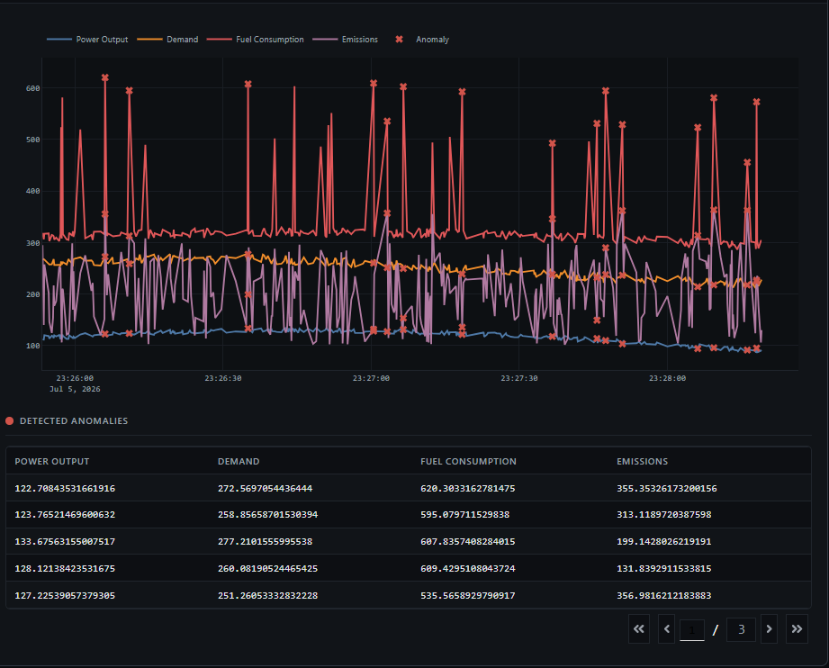
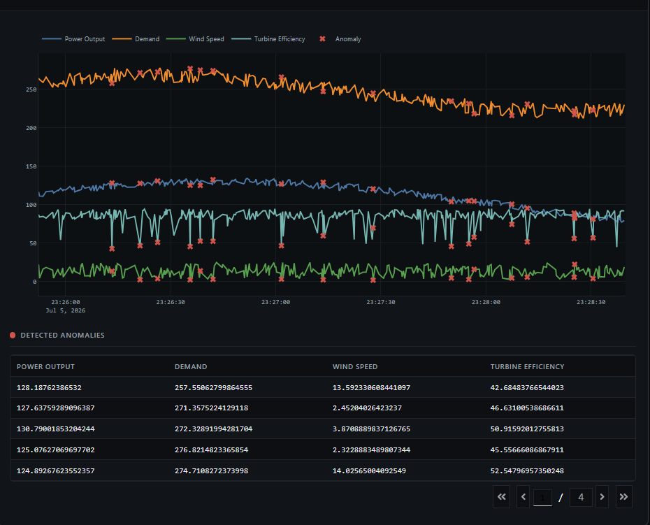
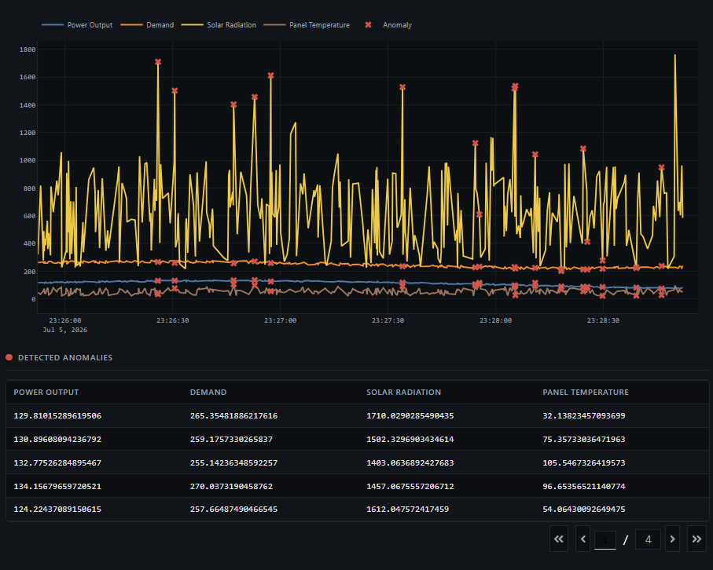
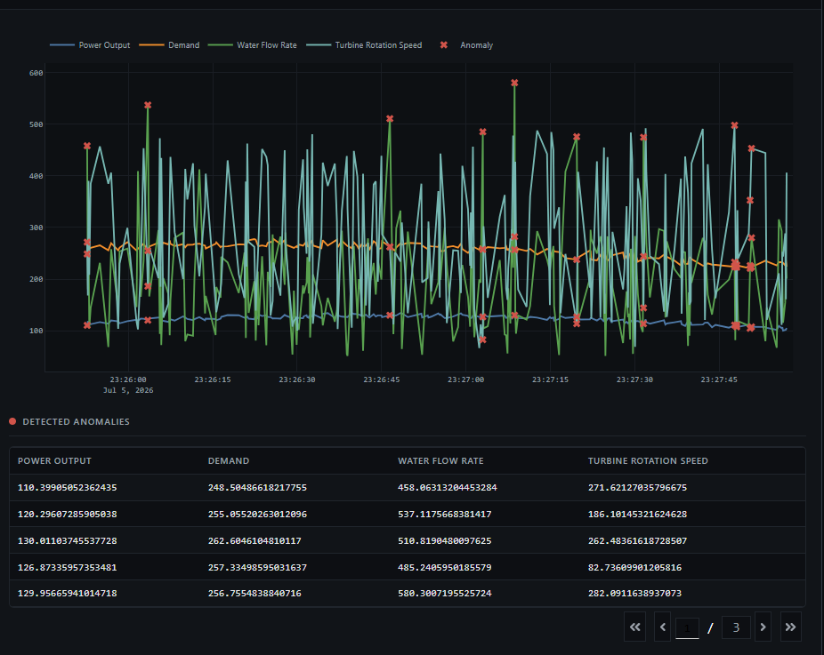

# Real-Time Energy Data Anomaly Detection

<p align="center">


</p>

---

# Real-Time Energy Data Anomaly Detection Pipeline

Real-Time Energy Data Anomaly Detection is a scalable streaming analytics application that simulates energy sensor data from multiple power plants and processes it in real time. The pipeline ingests streaming events with Apache Kafka, performs distributed anomaly detection using Apache Spark and machine learning algorithms, and visualizes system health through an interactive Dash dashboard. All services are containerized with Docker and orchestrated using Docker Compose, providing a reproducible and production-inspired development environment.

---

# Table of Contents

- Introduction
- Architecture Overview
- Prerequisites
- Setup Instructions
- Directory Structure
- Data Workflow
- Overall Pipeline
- Building and Running the Application
- Access the Dashboard
- User Interface (UI) Screenshots
- Why Isolation Forest for Anomaly Detection?
- Tech Stack

---

# Introduction

This project demonstrates a real-time energy monitoring and anomaly detection pipeline that simulates streaming data from multiple power generation sources, including **Gas Plants, Wind Farms, Solar Farms, and Hydroelectric Plants**. The generated data incorporates realistic operational characteristics such as seasonal trends, concept drift, and abnormal events to emulate real-world energy systems.

The streaming data is ingested through **Apache Kafka**, processed using **Apache Spark Structured Streaming**, and analyzed with the **Isolation Forest** machine learning algorithm to identify anomalous behavior. An interactive **Dash** web application provides real-time visualization of energy metrics, detected anomalies, and system performance. The complete solution is containerized with **Docker** and orchestrated using **Docker Compose** for simplified deployment and reproducibility.

---

# Architecture Overview

The pipeline consists of the following components:

* **Data Generator** – Simulates continuous energy sensor data from multiple power plant types with realistic operational patterns and injected anomalies.
* **Apache Kafka** – Serves as the distributed event streaming platform for reliable real-time data ingestion.
* **Apache Spark Structured Streaming** – Consumes streaming events from Kafka, performs data transformation, feature engineering, and real-time analytics.
* **Isolation Forest Model** – Applies machine learning-based anomaly detection to identify unusual operating conditions in the incoming data stream.
* **Dash Dashboard** – Displays live energy metrics, anomaly alerts, and interactive visualizations for real-time monitoring.
* **Docker Compose** – Manages and orchestrates all application services within a multi-container environment for consistent local deployment.

---

# Prerequisites

Before running the project, ensure the following requirements are met:

* Docker Desktop is installed and running.
* Docker Compose is available on your system.
* At least **4 GB** of memory is allocated to Docker (8 GB recommended for better Spark performance).
* A stable internet connection is available to download required Docker images and project dependencies.
* Git is installed to clone the repository.

---

# Setup Instructions

## 1. Clone the Repository

Open **Command Prompt (CMD)** or **PowerShell** and execute the following commands:

```bash
# Clone the repository
git clone https://github.com/vinaykandimalla01/Real-Time-Energy-Data-Anomaly-Detection.git

# Navigate into the project directory
cd Real-Time-Energy-Data-Anomaly-Detection

# Open the project in Visual Studio Code
code .
```

> **Note:** Ensure Git and Visual Studio Code are installed and that the `code` command is available in your system PATH.

---

# Directory Structure

```text
REAL-TIME-DATA-ANOMALY-DETECTION
│
├── .venv/
├── data_producer/
│   ├── Dockerfile
│   └── kafka_producer.py
│
├── real time anomalies detection model/
│   ├── Dockerfile
│   └── real_time_model.py
│
├── .gitignore
├── docker-compose.yml
└── requirements.txt
```

## Project Structure Description

| File / Folder | Description |
|---------------|-------------|
| **data_producer/** | Contains the Kafka data producer responsible for generating synthetic real-time energy data for different power plant types and publishing it to an Apache Kafka topic. |
| **data_producer/Dockerfile** | Defines the Docker image for the Kafka producer service, including the Python runtime and required dependencies. |
| **kafka_producer.py** | Simulates realistic energy telemetry by generating data with seasonal trends, concept drift, and injected anomalies before continuously streaming it into Kafka. |
| **real time anomalies detection model/** | Contains the real-time analytics and visualization application responsible for stream processing, anomaly detection, and dashboard rendering. |
| **real_time_model.py** | Consumes streaming data from Kafka using Apache Spark Structured Streaming, applies Isolation Forest for anomaly detection, and visualizes live metrics and detected anomalies through an interactive Dash dashboard. |
| **real time anomalies detection model/Dockerfile** | Builds the Docker image containing Spark, Dash, and all dependencies required for the analytics service. |
| **docker-compose.yml** | Orchestrates all project services, including Kafka, Spark, the data producer, and the anomaly detection dashboard, allowing the complete application to run with a single command. |
| **requirements.txt** | Lists all Python libraries required for the project, including Kafka, Spark, Dash, Pandas, NumPy, Scikit-learn, and other dependencies. |
| **.gitignore** | Specifies files and directories that Git should ignore, such as virtual environments, cache files, and temporary artifacts. |

---

# Data Workflow

The project follows a real-time streaming architecture for continuous energy monitoring and anomaly detection.

## Step 1 – Energy Data Generation

The **Kafka Producer** continuously generates synthetic telemetry data for four types of power plants:

- Gas Plant
- Wind Farm
- Solar Farm
- Hydroelectric Plant

Each record contains operational metrics such as power output, demand, and plant-specific parameters. Seasonal behavior, concept drift, and random anomalies are injected to simulate realistic operating conditions.

⬇

## Step 2 – Real-Time Data Streaming

The generated sensor data is serialized into JSON format and published to the Apache Kafka topic:

```text
energy_stream
```

Kafka acts as a high-throughput, fault-tolerant messaging system between the producer and downstream analytics engine.

⬇

## Step 3 – Stream Processing

Apache Spark Structured Streaming subscribes to the Kafka topic and continuously processes incoming events in near real time.

During processing, Spark:

- Reads streaming data from Kafka
- Parses JSON records
- Applies schema validation
- Converts timestamps
- Organizes data by power plant type
- Maintains a sliding window of recent observations for analysis

⬇

## Step 4 – Machine Learning-Based Anomaly Detection

The processed data is analyzed using the Isolation Forest algorithm.

The model:

- Learns normal operating behavior
- Detects unusual patterns without labeled training data
- Identifies anomalous sensor readings
- Updates anomaly results continuously as new data arrives

⬇

## Step 5 – Interactive Dashboard

The Dash web application continuously displays:

- Live energy metrics
- Time-series graphs for each power plant
- Detected anomaly points
- Real-time anomaly tables
- Continuous dashboard updates every second

---

# Overall Pipeline

```text
                     Synthetic Energy Data
                               │
                               ▼
                  Kafka Producer (Python)
                               │
                               ▼
                     Apache Kafka Topic
                      (energy_stream)
                               │
                               ▼
          Apache Spark Structured Streaming
                               │
               Data Validation & Processing
                               │
                               ▼
         Isolation Forest Anomaly Detection
                               │
                               ▼
              Dash Interactive Dashboard
                               │
      Live Charts • Metrics • Anomaly Tables
```

This workflow enables continuous ingestion, real-time analytics, machine learning-based anomaly detection, and live visualization of energy data within a fully containerized Docker environment.

---

# Building and Running the Application

## Build the Docker Images

From the project's root directory, build all required Docker images by executing:

```bash
docker-compose build
```

This command creates the Docker images for the data producer and the real-time anomaly detection application using their respective Dockerfiles, along with any additional services defined in the `docker-compose.yml` file.

---

## Start the Services

Launch the complete application stack using Docker Compose:

```bash
docker-compose up
```

This command starts all required services, including:

- **Zookeeper** – Coordinates Kafka brokers.
- **Apache Kafka** – Streams real-time energy data between services.
- **Spark Master** – Manages Spark cluster resources.
- **Spark Worker** – Executes distributed streaming workloads.
- **Data Producer** – Generates synthetic energy telemetry and publishes it to Kafka.
- **Real-Time Anomaly Detection Service** – Consumes streaming data, performs anomaly detection, and hosts the interactive dashboard.

> **Note:** The initial execution may take several minutes as Docker downloads base images and installs the required dependencies.

---

# Access the Dashboard

Once all containers are running successfully, open your browser and navigate to:

```text
http://localhost:8050
```

The dashboard provides real-time visualization of:

- Live energy sensor readings
- Power plant performance metrics
- Time-series analytics
- Detected anomalies
- Interactive monitoring dashboards

This workflow enables continuous ingestion, real-time analytics, machine learning-based anomaly detection, and interactive visualization within a fully containerized streaming data pipeline.

---

# User Interface (UI) Screenshots

The following screenshots showcase the interactive dashboard developed using Dash, providing real-time monitoring of energy generation metrics and anomaly detection across different power plant types. The dashboard enables users to visualize live streaming data, identify abnormal operating conditions, and monitor plant-specific performance through interactive charts and tables.

## Gas Plant Monitoring



---

## Wind Farm Monitoring



---

## Solar Farm Monitoring



---

## Hydroelectric Plant Monitoring



---

# Why Isolation Forest for Anomaly Detection?

**Isolation Forest** is a widely used unsupervised machine learning algorithm for anomaly detection because it efficiently identifies rare and abnormal observations without requiring labeled training data. It is particularly well-suited for real-time streaming applications where anomalous events are infrequent and data continuously evolves.

## Key Advantages

- **Unsupervised Learning** – Detects anomalies without requiring labeled datasets, making it ideal for real-time energy monitoring where abnormal events are difficult to label in advance.

- **Efficient for High-Dimensional Data** – Processes multiple operational features simultaneously, enabling effective analysis of complex power plant metrics such as power output, demand, emissions, wind speed, solar radiation, and water flow rate.

- **Adaptive to Changing Data Patterns** – When used with a sliding window approach, the model continuously learns from recent data, allowing it to adapt to seasonal trends, concept drift, and changing operating conditions.

- **Fast and Scalable** – Offers near-linear time complexity, making it highly efficient for processing large volumes of streaming data with minimal computational overhead.

- **Accurate Anomaly Detection** – Identifies abnormal observations by isolating data points rather than modeling normal behavior, making it effective at detecting rare operational faults and unexpected system events.

- **Minimal Configuration Requirements** – Requires only a few hyperparameters, enabling quick deployment and easy integration into production-grade real-time analytics pipelines.

- **Suitable for Streaming Analytics** – Works seamlessly with Apache Spark Structured Streaming, allowing anomalies to be detected continuously as new energy data arrives.

This combination of speed, scalability, adaptability, and unsupervised learning makes Isolation Forest an excellent choice for real-time anomaly detection in streaming energy monitoring systems.

---

# Tech Stack

- Python
- Apache Kafka
- Apache Spark Structured Streaming
- Scikit-learn (Isolation Forest)
- Dash
- Docker
- Docker Compose
- Apache ZooKeeper
- Git
- GitHub


---

# Author

<p align="left">

**Created By:** [Vinay Kandimalla](https://www.linkedin.com/in/vinay-kandimalla-52b16929b)

**Created On:** **2026**

 


</p>

---

⭐ If you found this project helpful, consider giving it a **Star** on GitHub!